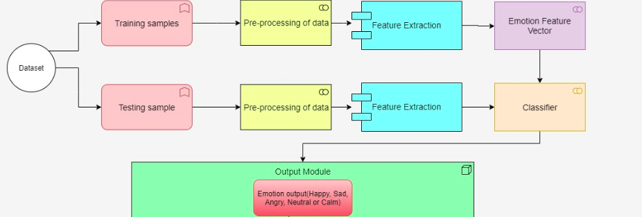
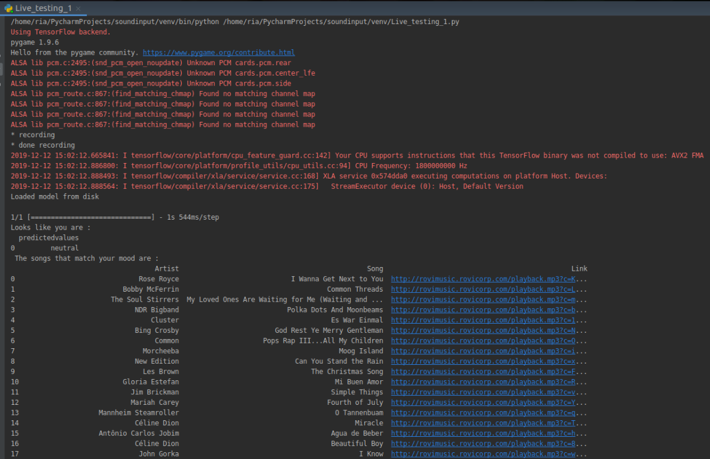

# Smart music player using Speech emotion recognition
We use speech to determine the emotion of a user. We make use of the vocal characteristics of the user for the task without considering the semantics. This makes it a text independent method of speech recognition. The aim of this project was to create a smart music player based on the emotion of the user that not only recommends, but creates music fit for that particular emotion. 
The building blocks of the module consists of identifying the emotion of a given user and recommending songs which mirror the mood of the user, meanwhile suggesting the songs that the user should listen to improve the mood. This takes a live audio sample of the user as input and processes it to predict the emotion. The emotion is mapped to a few related songs which is displayed in the console for the user to choose from.

### Dataset used for Music Recommendation module 
 
The Ryerson Audio-Visual Database of Emotional Speech and Song (RAVDESS) was used as our dataset to train the classification model for emotion recognition. It consists of around 1500 files with 24 actors (12 male + 12 female) speaking with 8 different emotions. However, we have considered only 5 of those emotions - happy, sad, calm, angry and neutral. We also used a list of 900 songs with emotion tags for all the five emotions used in our project to recommend songs to the user fitting his/her mood.

### Code details

##### CNN.ipynb -- This is the model used for training the data
##### Live_testing.py -- Code for live prediction by accepting a real time user audio for emotion recognition

#### References

[1] K. Zhao, S. Li, J. Cai, H. Wang and J. Wang, "An Emotional Symbolic Music Generation System based on LSTM Networks," 2019 IEEE 3rd Information Technology, Networking, Electronic and Automation Control Conference (ITNEC), Chengdu, China, 2019  
[2] S. Lukose and S. S. Upadhya, "Music player based on emotion recognition of voice signals," 2017 International Conference on Intelligent Computing, Instrumentation and Control Technologies (ICICICT), Kannur, 2017  
[3] P. Tzirakis, J. Zhang and B. W. Schuller, "End-to-End Speech Emotion Recognition Using Deep Neural Networks," 2018 IEEE International Conference on Acoustics, Speech and Signal Processing (ICASSP), Calgary, AB, 2018  
 [4] Livingstone SR, Russo FA (2018) The Ryerson Audio-Visual Database of Emotional Speech and Song (RAVDESS): A dynamic, multimodal set of facial and vocal expressions in North American English. PLos ONE 13(5): e0196391. https://doi.org/10.1371/journal.pone.0196391  
[5] Curtis Hawthorne, Andriy Stasyuk, Adam Roberts, Ian Simon, Cheng-Zhi Anna Huang, Sander Dieleman, Erich Elsen, Jesse Engel, and Douglas Eck. "Enabling Factorized Piano Music Modeling and Generation with the MAESTRO Dataset." In International Conference on Learning Representations, 2019.  
[6] Yuanyuan Zhang, Jun Du, Zirui Wang, Jianshu Zhang, Yanhui Tu, Attention Based Fully Convolutional Network for Speech Emotion Recognition , arXiv:1806.01506v2 May 2 2019  
[7] Saikat Basu ,Jaybrata Chakraborty , Arnab Bag , Md. Aftabuddin, A review on emotion recognition using speech, 2017 International Conference on Inventive Communication and Computational Technologies (ICICCT)  
[8] M. Kattel, A. Nepal, A. K. Shah, D. Shrestha Department of Computer Science and Engineering, School of Engineering Kathmandu University, Nepal : Chroma Feature Extraction  
[9] Pratheeksha Nair, The dummy’s guide to MFCC (https://medium.com/prathena/the-dummys-guide-to-mfcc-aceab2450fd)  

